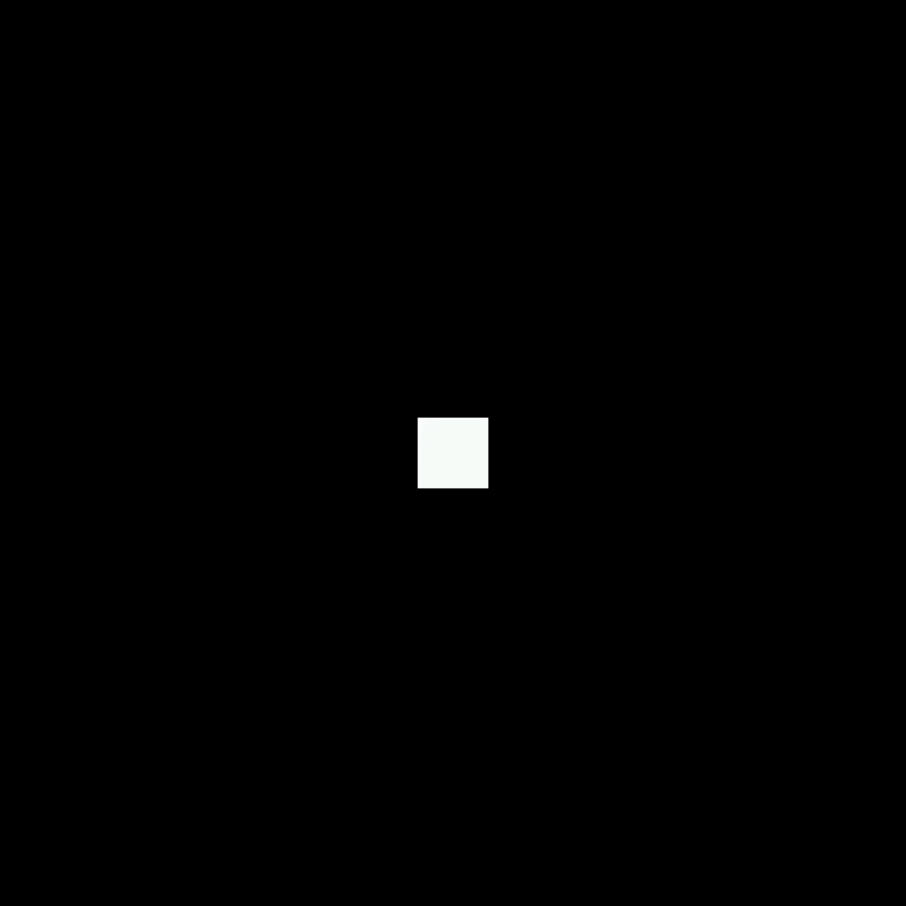

# Connect and First Save
First things first, make sure your **Thumby Color** or **Thumby Color Dev Board** is connected to your computer using a USB-C cable. Once physically connected, press the **red stop sign** symbol in the top left of Thonny. The **Shell** window will output the **>>>** prompt once connected.

Inside **Thonny**, left-click the **< untitled >** pane and then press **ctrl-s** and choose **Raspberry Pi Pico**:


Next, navigate into the **Games** folder by double left-clicking it, and then right-click anywhere and choose **New Directory...**


Choose any name for your game folder and then navigate into it. Name the file you're saving as **main.py** and press **OK**.


Now anytime you press **ctrl-s**, the file will be saved to the device.


# First Game
To create a very basic scene we need to:

* Import `engine_main` to set the engine up
* Import `engine` for starting or ticking
* Import the nodes we want and a camera
* Create the nodes
* Start the engine

```py
import engine_main
import engine
from engine_nodes import Rectangle2DNode, CameraNode

rectangle = Rectangle2DNode()
camera = CameraNode()

engine.start()
```


A white square on a black background!  Pushing any of the buttons does nothing, and you'll have to restart the Thumby Color by flipping the power switch (or hit Thonny's "Stop/Restart backend" button if we've got the Thumby Color connected).  Well, that's boring.

## Start() and Tick()
Now, there are two main ways to run the game engine:  `engine.start()` and `engine.tick()`.

* `engine.start()` is a more object-oriented way of running the game engine:  you set up all your Nodes with `.tick()` attributes to update them, and then call `engine.start()` and let it rotate through all your Nodes, calling their respective `.tick()` attributes during each frame.
* `engine.tick()` is more procedural.  You call `engine.tick()` to check whether the engine has started the next frame; True = yes, False = no.  Note that when it is time, the call to `engine.tick()` will also call all your Nodes' `.tick()` attributes.

## Child Class
In this case, we're just tinkering with a measly two types of Nodes and have no plans to make an actually fun game (OR DO WE?), so we'll stick with `engine.start()`.  That means we need to add a `.tick()` attribute to our little white square... and THAT means we'll need to make a new class for the Node representing the square.  Replace the line `rectangle = Rectangle2DNode()` with the following:

```py
class MovableRectangle(Rectangle2DNode):
    def __init__(self):
        super().__init__(self)

rectangle = MovableRectangle()
```

So.  This creates a new class called "MovableRectangle", based on the Rectangle2DNode class we've been using to make our small white square, and describes how to initialize an instance - namely, call the initialization routine from the parent class.  Save.  Feel free to run it, but we haven't provided instructions on how to deal with buttons, so nothing has visibly changed.  Let's fix that.

## Button Input
Underneath the `from engine_nodes` line, add the following:

```py
import engine_io

engine.fps_limit(60)
```

We need the `engine_io` import to read the buttons, and we want to be sure our game's FPS doesn't go to infinity since we're not doing very much during each frame.  Then, after the `super().__init__(self)` line (so within the class definition for MovableRectangle), add the following (indentation matters!):

```py
    def tick(self, dt):
        if engine_io.LB.is_pressed:
            self.rotation = self.rotation - 0.031415926535
        if engine_io.RB.is_pressed:
            self.rotation = self.rotation + 0.031415926535
```

Now that we have `engine_io`, we add a `.tick()` attribute to our MovableRectangle class with a couple button checks:  pressing the left shoulder button should rotate the square to the left, and the right shoulder button should rotate it to the right.  (The rotation measurement is in radians, so that's why the increment is one-hundredth of pi.)  Save and run!



Yay, it rotates!  ...wait a moment, it's rotating clockwise when we press LB, and counterclockwise when we press RB.  I guess I got the signs wrong.  Feel free to change LB to addition  (and RB to subtraction) to fix this.  Also feel free to experiment with different increment values - I picked a rather small increment to match the frame rate of 60 frames per second (as-is, it'd take 200 frames, or a little over three seconds, to complete a rotation).

Let's add some D-pad functionality.  Add the following to the `def tick(self, dt):` block (it can be before or after the LB and RB `if` statements, just don't put it in the middle of one!):

```py
        newPos = self.position
        if engine_io.LEFT.is_pressed:  newPos.x = newPos.x - 1
        if engine_io.RIGHT.is_pressed: newPos.x = newPos.x + 1
        if engine_io.UP.is_pressed:    newPos.y = newPos.y - 1
        if engine_io.DOWN.is_pressed:  newPos.y = newPos.y + 1
        self.position = newPos
```

Stop, save, run.  Yay, the square moves!  You press left, it goes left;  you press up, it goes up;  you press right, it goes right;  and you press down, it goes down.  And if you keep pressing in a direction... it goes off the edge of the screen.  Oops.  Let's cap how far the square can move;  add the following, just before the `self.position = newPos` line:

```py
        if newPos.x < -64: newPos.x = -64
        if newPos.x >  64: newPos.x =  64
        if newPos.y < -64: newPos.y = -64
        if newPos.y >  64: newPos.y =  64
```

Now our little square hits the edge of the screen and stops.  We could add instructions for what the A and B buttons do, we could mess with the CameraNode... but let's do something a bit different.
